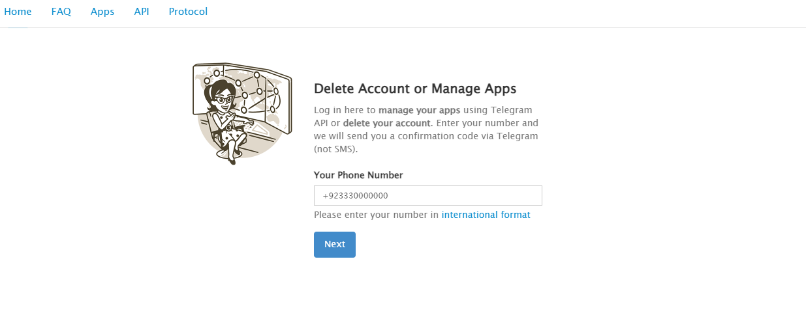
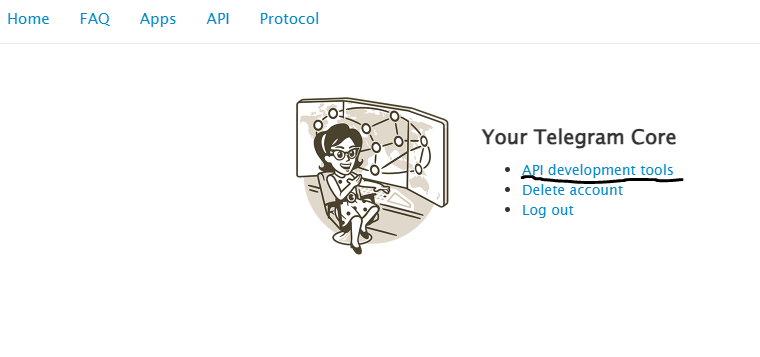
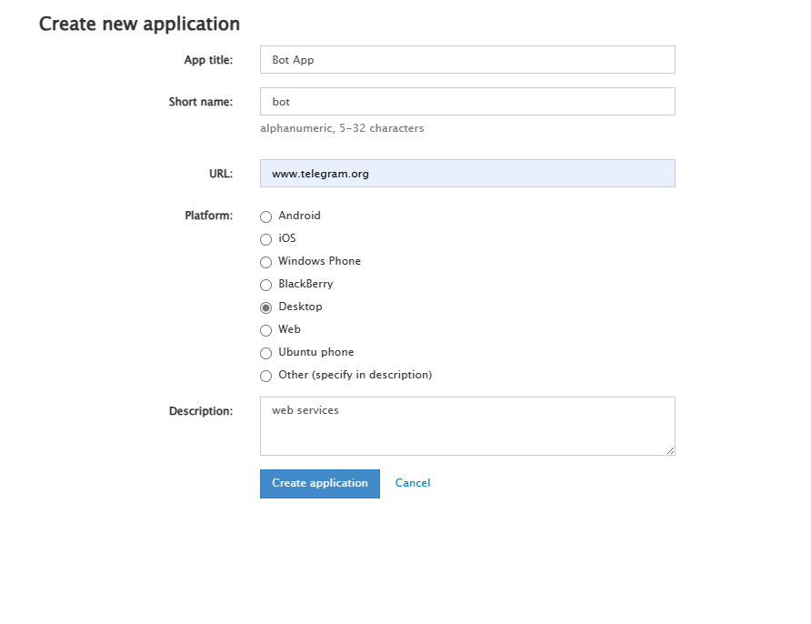
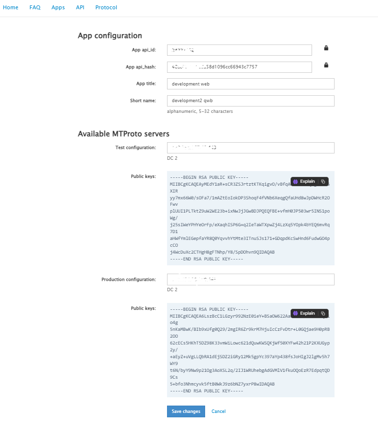

# Telegram API ID and Hash ID documentation

## Description
This repository explains the process of getting API ID and Hash ID to operate the Pip Xpert APP.

## Step 1: 
Open https://my.telegram.org/auth and enter your phone number.

## Step 2:
After signing up select the API development tools option.

## Step 3:
 Fill out the required information as given below.
 

 ## Step 4:
 Copy the following API ID and Hash ID.
 
 
